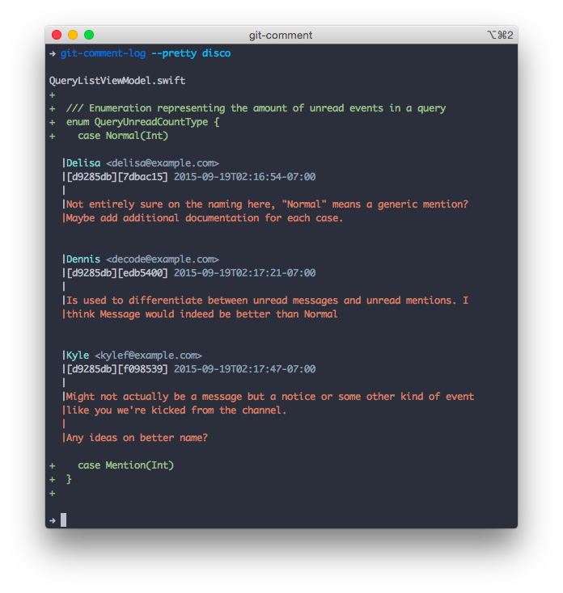

#  [](https://circleci.com/gh/git-comment/git-comment/tree/master)

Comments for git commits and files. Open and distributed collaboration
around code and other version-controlled text and resources.

**Project Status:** Early Alpha

## Why?

Comments on git commits are siloed into various web services or backed
up externally, when all repo history can be stored together and
accessible offline.



## Uses

* Storing git comment history in every local copy
* Unified and open format for web services to store comments
* Reviewing and annotating code while offline
* Viewing comments and associated context diffs offline
* Pre- and post-comment hooks for validation with web services
* Searching for comments by commit or text while offline
* Exporting comments from web services into local backups

To meet these requirements, `git-comment` ships with a few helpful
components:

* `git-comment`: adds comments
* `git-comment-log`: prints comments inline with diffs
* `git-comment-grep`: searches comment content for text
* `git-comment-web` (Incomplete): launches a web server hosting a friendly
  web UI for comment editing
* `git-comment-remote`: helpful tools for working with a remote server
  with git comment, like configuring remotes to push and pull comments
  by default, indexing comments for search after push, and deleting remote
  comments

More information and usage is available in the manual or the User Guide.

## Installation

### Source

Instructions for source installation are provided in the `INSTALL` file.

### OS X via Homebrew

There is an automated source installation available for OS X from the [git-comment tap](https://github.com/git-comment/homebrew-formulae). To install, run:

```
brew install git-comment/formulae/git-comment
```

## Support

* [User Guide](https://github.com/git-comment/git-comment/blob/master/docs/User%20Guide.md)
* [Manual](https://github.com/git-comment/git-comment/tree/master/docs/man)
* `#git-comment` on freenode IRC
* [Search open and closed issues](https://github.com/git-comment/git-comment/issues?utf8=✓&q=is%3Aissue) for similar problems
* [Open an issue](https://github.com/git-comment/git-comment/issues/new)

## Contributing

The [CONTRIBUTING.md](https://github.com/git-comment/git-comment/blob/master/CONTRIBUTING.md) file details the setup process for building `git-comment` from source and submitting a change. There are many tasks in the roadmap ([docs/Roadmap.md](https://github.com/git-comment/git-comment/blob/master/docs/Roadmap.md)) to make git-comment a more robust collaboration tool. Contributions welcome!

## License

Copyright (c) 2015, Delisa Mason. All rights reserved.

`git-comment` uses the BSD license as detailed in the `LICENSE` file.
